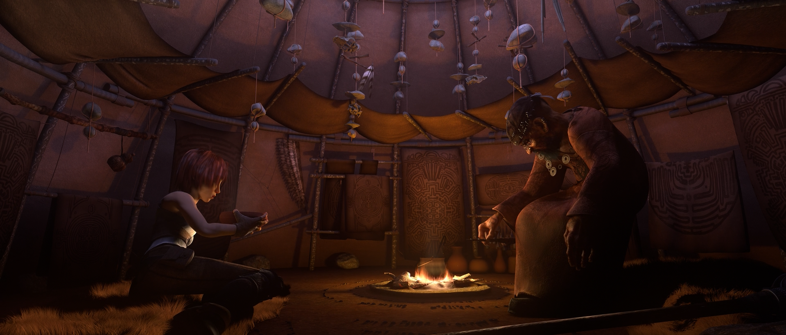

# mpv neural preset for RTX 5090 — a homebrew madVR Envy

A living-room video processor on your own hardware: judder-free film cadence
(no 3:2 pulldown), RIFE frame interpolation, neural anime upscaling to 4K/8K,
HDR passthrough. All real-time, all free, all on one GPU.

Built and battle-tested 2026-07-12 on an RTX 5090 (4K@144 display, later
8K@60 + 4K@165). Cadence adapts to the panel automatically: film plays 6:6 on
144 Hz, PAL/NTSC lock via fractional multipliers (82.5/55), 8K@60 gets an even
60. For reference: a madVR Envy Extreme MK2 ships with an RTX 4080 inside, and
Envy has no frame interpolation at all.

## Hotkeys (all modes)

| Key | Mode | What for |
|---|---|---|
| `e` | **Envy: upscale + interpolation** | The main anime button. 1080p24 -> 4K 72fps in a single graph |
| `r` | **RIFE interpolation** | Live-action film. Output rate auto-locks to the display (144/72/60, PAL/NTSC via fractional multipliers) |
| `u` | **AnimeJaNai 2x upscale** | Anime up to 1080p -> 4K, native frame rate (24 fps as shot) |
| `8` | **8K profile** | Neural 2x to 7680x4320 for 4K sources. On 60 Hz panels film is additionally interpolated to 30 fps (2:2 lock, no 3:2 judder); full 60 plus the 8K upscale does not fit the 5090 budget |
| `b` | Debanding | Gradient banding (streams, old encodes) |
| `TAB` | Stats | fps, drops, active filters |
| `s` | Screenshot | Saved to `Pictures\mpv-shots` |

Mode keys are **exclusive**: enabling one automatically disables the other.
Press the same key again to turn it off. On HDR content (PQ/HLG) the upscale
networks stay off (they are trained on SDR): `u` and `8` refuse with an
on-screen explanation, `e` gracefully degrades to pure RIFE.

## Desktop buttons (`desktop-tools/`)

Two tiny dependency-free executables, built with `build.cmd` (csc from .NET
Framework ships with every Windows). Make shortcuts with arguments.

| Button | Command | What it does |
|---|---|---|
| 8K 60 Hz | `SetDisplay.exe 7680 4320 60` | Regular film mode (4K content + `r`/`e`) |
| 8K 24 Hz cinema | `SetDisplay.exe 7680 4320 24` | Only for the `8` key: neural 8K locks 1:1 |
| 4K 165 Hz | `SetDisplay.exe 3840 2160 165` | Gaming mode |
| HDR on / off | `HdrSwitch.exe on` / `off` | Panel HDR (also `toggle`, `status`) |

`SetDisplay.exe list` prints every mode the panel offers. `HdrSwitch.exe status`
returns via exit code: 0 off, 1 on, 2 unsupported. On failure both tools speak
up with a message box instead of dying silently.

Pitfalls baked into them:
- **Win11 26200: the legacy API lies about HDR.** `GET_ADVANCED_COLOR_INFO`
  (type 9) returns advancedColorEnabled=1 always. The honest state is only in
  `GET_ADVANCED_COLOR_INFO_2` (type **15**, field activeColorMode: 0=SDR 1=WCG
  2=HDR); the setter is `SET_HDR_STATE` (type **16**), legacy (10) kept as
  fallback.
- **HDR applies over seconds, not instantly.** Checking the state right after
  the setter is useless (reports failure on a successful switch): poll for up
  to 4 s.
- **Multi-monitor:** walk every path and count one success as success,
  otherwise you die on the first display that doesn't support HDR.
- **EnumDisplaySettings silently fails from PowerShell 5.1** (DEVMODE
  marshaling); works fine from a C# exe.

## Measurements (RTX 5090, all with 0 drops)

| Scenario | Result |
|---|---|
| Film 24 fps, no filters | every frame shown exactly 6 times at 144 Hz, pulldown physically impossible |
| RIFE 1080p24 (v4.26 x6) | 143.86 fps |
| RIFE 4K24 (v4.25_lite x3) | 71.93 fps, 20% throughput headroom |
| RIFE 25 fps PAL (fractional x5.76) | exactly 144.0 |
| RIFE 29.97 NTSC (fractional x4.8) | exactly 144.0 |
| Envy graph 1080p24 -> 4K 72fps | 98 fps throughput against 72 needed |
| AnimeJaNai 4K -> 8K | 36.3 fps (handles 24/30 film), 3.7 GB VRAM |
| `8` key on a live 8K@60 panel (RIFE to 30 + upscale) | exactly 30.0 fps to a 7680x4320 panel |
| RIFE 4K on a live 8K@60 panel (fractional x2.5) | exactly 60.0 fps |
| HDR PQ through RIFE | gamma/primaries/10-bit pass through untouched |
| Output jitter: before / after clock lock | 0.0654 -> 0.0001 (650x) |
| **Real film**, 4K HDR10+ 10-bit on 8K@60 fullscreen + RIFE | 0 drops, panel at 60.0 Hz, jitter 0.005 (was 1537 drops) |
| Neural 8K (`8` key) on 8K@60 fullscreen | does NOT fit: 17 Hz with interpolation, 57 without |
| Neural 8K on 8K@24 fullscreen | 0 drops, 1:1 lock: the only viable mode for 8K upscaling |

## Before / after

1080p source vs AnimeJaNai 2x output (crops from the test run):

| Original 1080p | AnimeJaNai 4K |
|---|---|
|  |  |

## Architecture

```
mpv (vo=gpu-next, d3d11) --vf vapoursynth--> VS R76 (embedded Python 3.14)
    -> vs-mlrt v15.16 (TensorRT 10.16, engines cached on disk)
        -> RIFE v4.26 (<=1440p) / v4.25_lite (4K) - interpolation
        -> AnimeJaNai V3.1 SPANF3 (Balanced) - 2x upscale
```

- `portable_config/mpv.conf` - cadence (display-resample + oversample), HDR passthrough, ewa_lanczossharp scaling
- `portable_config/*.vpy` - filter graphs (rife / janai / envy / janai8k)
- `portable_config/scripts/smart-modes.lua` - hotkeys, exclusivity, HDR gate
- `portable_config/scripts/gpu-clock-lock.lua` - memory clock lock while watching (see pitfalls)

## Pitfalls paid for in blood (the main lessons)

1. **Two chained vapoursynth filters strangle each other.** Upscale and RIFE
   as two `--vf` entries give 24.8 fps; the same two steps in one VS graph
   give 107 fps. Every "jumpy fps" report about packaged AnimeJaNai+RIFE
   builds is cured by stitching them into a single .vpy.
2. **RIFE v4.6 paints a waffle onto grain.** On the temporal grain of real
   rips (Netflix, old BDs) v4.6 in every mode (fp16/fp32/scale) produces a
   regular waffle grid on interpolated frames. Cure: v4.26 up to 1440p,
   v4.25_lite at 4K. Both at full flow (scale=1).
3. **Combo-mode order: RIFE before upscale.** At source resolution the clean
   new models are fast enough; interpolating after the upscale means running
   RIFE at 4K, where the fast-model selection is poorer.
4. **Full-range washes out without symmetry.** YUV->RGB->YUV conversion
   without an explicit range on both sides squeezes full-range into limited
   (blacks turn gray). Fix: RemoveFrameProps + range_in_s/range_s="limited"
   symmetrically; full range passes through RGBH as out-of-range float,
   bit-exact.
5. **The fractional path must set AssumeFPS.** The mpv bridge hands over a
   clip with fps 0/0, vsmlrt skips its own AssumeFPS, frames inherit the full
   source duration: slow motion. The integer path is unaffected (Interleave
   divides durations itself).
6. **The mpv bridge does not pass colorimetry in frame props.** Only
   _ColorRange/_ColorSpace/_ChromaLocation. No _Transfer/_Matrix/_Primaries,
   so the HDR gate lives in lua (mpv knows gamma before the filter), and the
   matrix is a constant heuristic (decode and encode with the same constant
   cancel out).
7. **floor at the refresh-rate boundary.** A panel reporting 143.856 instead
   of 144 drops `int(target // fps)` from 6 to 5. Pick the multiplier only by
   checking the lock with 1% tolerance (the display-resample speed-adjustment
   limit).
8. **Measure FULLSCREEN, not windowed.** The most expensive methodology
   lesson of the week. Every windowed measurement lies: rendering a small
   window is cheap, while fullscreen on an 8K panel is 33 Mpix per vsync. Two
   bugs hid exactly behind this: the flip model (below) and the nonviability
   of neural 8K.
9. **The d3d11 flip model strangles 8K@60 fullscreen down to 32 Hz.** The
   panel reports 60 while `estimated-display-fps` says 31.8: every second
   vsync vanishes, jitter 1.85, and with RIFE on, 1537 drops in 30 seconds.
   Cure: `d3d11-flip=no` (jitter 0.003, honest 60) or `gpu-api=vulkan`
   (0.0157). HDR passthrough survives either. Windowed, the bug is completely
   invisible.
10. **The 8K budget is real: inference plus 33 Mpix output don't add up.**
   RIFE on 4K frames hits 81.6 fps with vo=null, but with real output to 8K
   only 46-49 against the needed 60 (num_streams and cuda-graph don't save
   it: 32 and 44). So on 60 Hz panels with 4K+ content the target is 30 fps
   (2:2 lock, half the work, still no 3:2 judder). Neural 4K->8K upscaling
   together with 8K output doesn't fit at all (17 Hz); it lives only on a
   panel switched to 8K@24 with a 1:1 lock.
11. **The once-per-second microstutter is a P-state, not the player.** With
   two monitors of different refresh rates (1440p@360 + 8K@60) and the low
   load of video playback, the driver drops memory clocks 15306 -> 7001 MHz
   and back every second; each transition freezes the GPU for a frame.
   Measured on BARE playback with no filters: 18 P0<->P3 transitions in 19
   seconds, output jitter 0.065 versus 0.0001 with locked memory (650x).
   Cure: `gpu-clock-lock.lua` runs `nvidia-smi -lmc` for the duration of
   playback and `-rmc` on exit. If mpv is KILLED (not closed), the lock
   stays: release it with `nvidia-smi -rmc` or just open and close the
   player. The NVIDIA control panel's "Prefer maximum performance" does the
   same thing, but globally and around the clock.

## Install from scratch

Components (versions of the working build):

1. **mpv** x86_64-v3 from [shinchiro](https://github.com/shinchiro/mpv-winbuild-cmake/releases)
   (2026-06-10 build, v0.41 git): unpack into `C:\Apps\mpv`
2. **Python 3.14 embeddable** from python.org: unpack into the same folder,
   add the line `Lib\site-packages` to `python314._pth`
3. **VapourSynth R76 portable** ([releases](https://github.com/vapoursynth/vapoursynth/releases)):
   unpack into the same folder, install the wheel:
   `python.exe -m pip install wheel\VapourSynth-*.whl` (bootstrap pip via
   get-pip.py first). Copy `vsscript.dll` (as `VSScript.dll`) and
   `libvapoursynth.dll` from `Lib\site-packages\vapoursynth\` into the mpv root
4. **vs-mlrt TensorRT** ([v15.16](https://github.com/AmusementClub/vs-mlrt/releases)):
   unpack into `vs-plugins\`
5. **Models**: RIFE `rife_v4.26.7z`, `rife_v4.25_lite.7z` (same place, the
   external-models release) into `vs-plugins\models\rife\`; AnimeJaNai V3.1
   SPANF3 from the [overlay pack 3.5.0](https://github.com/the-database/mpv-AnimeJaNai/releases)
   into `vs-plugins\models\animejanai\`; miscfilters
   ([R2](https://github.com/vapoursynth/vs-miscfilters-obsolete/releases)) into `vs-plugins\`
6. **Configs from this repository** into `portable_config\`
7. **VSScript config**: put `vapoursynth.toml` from this repo into
   `%APPDATA%\vapoursynth\` (adjust the paths inside to your install).
   Without it mpv can't find Python: "Failed to initialize VSScript"
8. **Desktop buttons** (optional): run `desktop-tools\build.cmd`, then make
   shortcuts with the arguments from the table above

MSIX trap: if you install from a shell running inside an MSIX container
(Claude Desktop and the like), writes to `%APPDATA%` are virtualized and don't
exist outside. Workaround: deploy the file via a one-shot Task Scheduler job
(`setup\_deploy_toml.cmd`).

The first launch of each mode at a new resolution builds a TensorRT engine
(1-2 minutes, once); the cache lives in `vs-plugins\trt-engines\`.

## Licenses

The configs in this repository: do whatever you want. Models are NOT included:
AnimeJaNai by [the-database](https://github.com/the-database/mpv-AnimeJaNai),
RIFE by [hzwer/Practical-RIFE](https://github.com/hzwer/Practical-RIFE) via
[vs-mlrt](https://github.com/AmusementClub/vs-mlrt). Sintel / Tears of Steel
(test content) are (c) Blender Foundation, CC BY.
